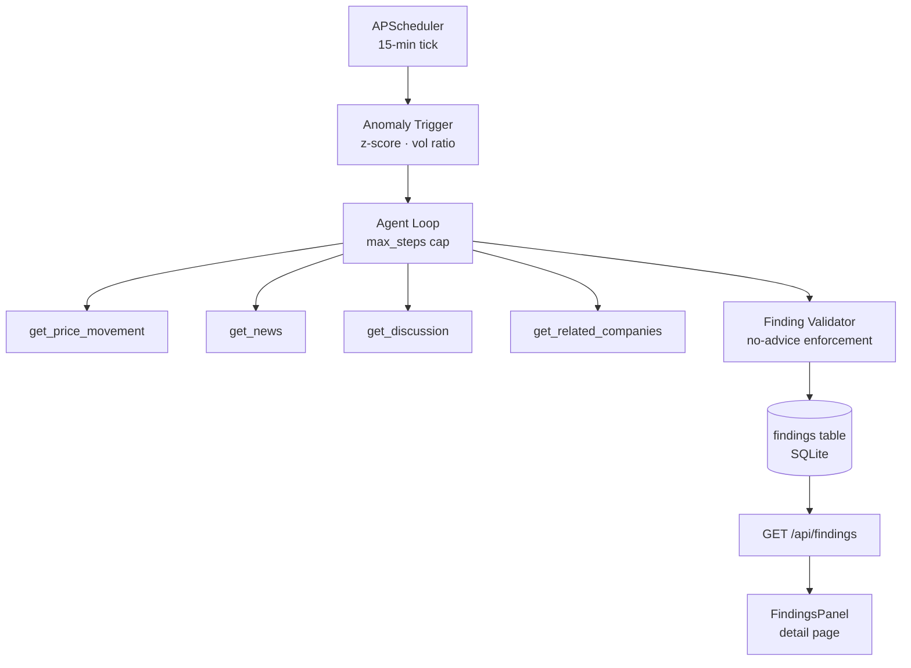

# Signal Intelligence Workspace

A local-first desktop tool for tracking market signals around a small set of companies. Connects price action with the news and discussion around it, locally, on your own machine.

src/docs/demo.mp4

---

## What it is

A progressive-disclosure workspace for understanding price action. Click a company on the graph to see the signals around it. Open the detail page to connect price moves with the news and discussion timestamps around them. The deeper intent is to answer not just *that* a stock moved, but *why*, surfacing the signals that give the move meaning.

---

## The investigation agent

The workspace was designed to grow toward more automatic interpretation: generated "why this moved" summaries, anomaly flagging, eventually richer signal sources. The investigation agent is that autonomy layer.

End to end: a scheduler scans the watchlist on an interval. When a ticker's return clears a z-score and volume-ratio threshold, a trigger fires. The agent receives the trigger and runs a bounded investigation loop, calling four read-only tools over the local SQLite database (price history, peer returns, news, discussion) and reasoning about what it finds at each step. When it reaches a conclusion, it emits a structured Finding: a hypothesis, a primary driver, evidence, and a confidence level. The Finding is validated in code before it is ever stored, then surfaces on the company's detail page.

---

## Architecture



---

## The governance boundary

The agent never gives advice, and that's not just a rule in a prompt. It's a guarantee enforced in code. Every Finding passes through `validate_finding` before reaching the database; any output with a non-null `advice` field is rejected outright, regardless of what the model wrote. The reason this matters in a finance context is asymmetry: a wrong buy/sell recommendation has consequences that a wrong hypothesis does not. The hypothesis surfaces for human judgment; the recommendation is structurally impossible. Two additional layers reinforce this. The loop has a hard `max_steps` cap so a runaway reasoning chain terminates with an "unexplained / needs human review" Finding rather than an open-ended conclusion. A per-session cost guard hard-stops the loop at $50 (with a $40 warning) so a single mis-triggered scan can't drain an API budget. Bounded autonomy is the point: the agent extends the analyst's reach without displacing their judgment.

---

## Evaluation

The eval harness (`server/agent/eval/run_eval.py`) runs the agent end-to-end against three seeded scenarios and applies a four-check rubric to each: correct primary driver, confidence in the expected band, governance respected (no advice), and scenario-specific evidence present. Real API calls, no mocks.

```
ticker  driver        conf    iters  tools     cost    drvr conf bndy evid   result
─────────────────────────────────────────────────────────────────────────────────────
NMBS    news          high    4      3       $0.0499    ✓    ✓    ✓    ✓    PASS ✓
ORCH    sector        medium  5      6       $0.0746    ✓    ✓    ✓    ✓    PASS ✓
DRFT    unexplained   low     6      6       $0.0709    ✓    ✓    ✓    ✓    PASS ✓
─────────────────────────────────────────────────────────────────────────────────────
3/3 scenarios passed   total cost $0.1953
```

**NMBS** is the news-driven hero case: a clear causal headline in the same session as the anomalous move. **ORCH** tests reasoning under ambiguity. Three biotech peers drop together with no company-specific news, so the correct call is sector co-movement at medium confidence, not a fabricated single cause. **DRFT** tests restraint: the trigger fires but nothing in the data explains the move, so the agent concludes "unexplained," flags it for human review, and doesn't invent a driver.

---

## Status

The investigation agent, eval harness, and detail-page surface are working end-to-end against the seeded scenarios above. The repo is public for review; it's in active development and not yet packaged for general setup. Live-data integration, additional signal sources, and the local LLM backend are in progress.

For navigation: the backend lives in `server/`, the agent in `server/agent/`, the eval harness in `server/agent/eval/`, and the detail-page surface in `src/detail/`.

---

## In development

- **Daily OHLCV backfill.** The anomaly trigger needs enough historical bars to compute a meaningful z-score. A backfill job will let the trigger fire on live data, not just the seeded demo scenarios.
- **Additional signal sources.** Congressional trade disclosures and sentiment indicators are natural next inputs: structured, public, and materially relevant in ways news and discussion sometimes aren't.
- **Local LLM backend.** The agent's `complete(...)` interface is provider-agnostic. A Nemotron Nano 4B backend is specced for fully offline operation with no API cost, at the cost of some reasoning depth.
- **Finding history surface.** A richer timeline view on the detail page, with driver distribution and confidence trend across findings as they accumulate.